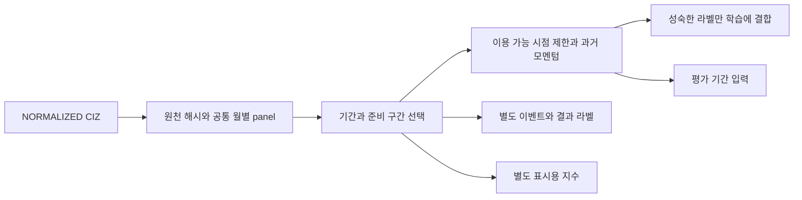

# PIT 연구 데이터 및 corporate action 처리

감사·갱신: 2026-10-06. 처리 규칙: `sigma-ciz-research-2`.
이 문서는 실행 가능한 현재 구현을 설명합니다. 과거 상태는 [초기 감사](PIT_DATASET_AUDIT.md),
원천 정의·실측 근거는 [CRSP source evidence](CRSP_SOURCE_EVIDENCE.md)에 있습니다.

## 범위와 데이터 흐름

원천은 `data/normalized/crsp/{daily,security_info,delistings}`의 canonical CIZ 파일입니다.
정규화 manifest의 실제 원천 테이블과 schema version을 검증하고, 존재하는 raw manifest도 확인합니다.
기존 수집·정규화 결과와 샘플은 수정하지 않습니다. demo/legacy 표본 디렉터리는 자동 탐색하지 않습니다.



`src/derive/catalog.py`는 원천 발견/해시, `temporal.py`는 캘린더/준비 구간/시간 규칙,
`events.py`는 API/SQL 공통 수익률 품질 규칙과 보유분 검증, `training_audit.py`는 label 및 표본 누락 감사,
`pipeline.py`는 DuckDB 구성과 저장을 담당합니다. `build_crsp_corporate_events.py`는 동일 CLI의 호환
진입점이며 독립 정책·출력 생성기는 제거했습니다. 기존 `build_period` 호출은 이전 안내와 함께 실패합니다.
기존 baseline common-stock 규칙을 재사용하며, 현재 팩터는 검증 가능한 trailing total-return momentum 하나입니다.
모델 학습과 거래 엔진은 구현하지 않습니다. 학습 가능한 데이터와 미래 원장 연결용 경계를 제공합니다.

## 실행

저장소 루트에서 실행합니다. 환경 구성은 [README](../README.md)를 참고합니다.

```sh
# 실제 로컬 데이터에서 검증한 실행
.venv-research/bin/python scripts/build_backtest_dataset.py \
  --start 2020-08-03 --end 2020-09-04 \
  --lookback 20 --training-sessions 20 --label-horizon 5 \
  --availability-lag 1 --decision after_close

# 과거 학습 의사결정 구간을 직접 지정할 수도 있습니다.
.venv-research/bin/python scripts/build_backtest_dataset.py \
  --start 2020-08-03 --end 2020-09-04 --lookback 20 \
  --train-start 2020-06-01 --train-end 2020-07-17 --label-horizon 5

# 표시 기준일만 변경: 공통 panel과 조건이 같은 factor cache 재사용
.venv-research/bin/python scripts/build_backtest_dataset.py \
  --start 2020-08-03 --end 2020-09-04 --lookback 20 \
  --training-sessions 20 --label-horizon 5 --index-base 2020-08-31

# 로컬 입력 증거를 다시 점검; 라이선스 샘플은 Git 제외 data/ 아래에 기록
.venv-research/bin/python scripts/inspect_research_inputs.py --calendar --full-terminal-check

# 생성된 run의 독립 검증 (2026-10-06 실제 실행 ID)
.venv-research/bin/python scripts/validate_research_run.py \
  data/derived/crsp/research/runs/6ddb7d6a3de7c78f1a34e4ef --data-root data

# 합성 fixture 검증 (WRDS나 실제 데이터 불필요)
.venv-research/bin/python -m unittest discover -s tests -v
```

`--data-root`는 `raw/`, `normalized/`, `derived/`를 포함하는 데이터 루트입니다.
`--output-root` 기본값은 그 아래 `derived/crsp/research`입니다. RAW/NORMALIZED 아래 출력을 거부합니다.
입력 파티션 누락, 전체 거래일 누락, 중복 키, 행을 증식시키는 metadata/event join은 실행을 실패시킵니다.

기본 `--quality-policy mark`는 원천 행을 보존하면서 미해결 수익률을 NULL로 표시하고 실행을
`INCOMPLETE_RETURNS`로 기록합니다. 수익률만 통과하고 종목정보 문제가 있으면 `INCOMPLETE_METADATA`입니다.
`--quality-policy fail`은 검토가 필요한 수익률/종목정보 행 또는 미해결 terminal 대조가 하나라도 있으면 run을
발행하지 않습니다. 이는 보유 종목을 모르는 데이터셋 단계의 보수적인 검사입니다. 실제 포지션별 판단은
아래 `validate_held_outcomes`를 사용합니다. 오류를 0 수익률로 바꾸거나 해당 종목을 과거부터 제거하지 않습니다.

`--pit-mode strict`와 `--execution next_open`은 현재 근거가 부족하므로 명시적으로 실패합니다.
기본 실행 표기는 `vendor_return_research`이며 `research_close_to_close`는 같은 연구 범위의 별칭입니다.

## 기간·캘린더·이용 가능 시각

XNYS 실제 거래일과 개장·폐장 시각을 `exchange_calendars`로 계산합니다. 주말 제거만으로 처리하지 않습니다.
전체 로컬 6,539 관측일은 이 캘린더와 일치했습니다. 다른 거래소 종목에도 공통 세션을 적용한다는 가정이며,
개별 종목의 실제 거래 가능성과 vendor membership 완전성을 증명하지는 않습니다.

| 개념 | 구현 의미 |
| --- | --- |
| `process_start` | 가장 이른 학습/평가 입력의 계산 의존성까지 확보하는 시작일 |
| `train_start`, `train_end` | 과거 학습 사례의 **의사결정 날짜**; 관측일이나 라벨 종료일과 다름 |
| `eval_start`, `eval_end` | 사용자가 선택한 평가 입력의 범위; 준비 구간 성과는 포함하지 않음 |
| `model_train_cutoff` | 첫 평가일의 의사결정 시각; 고정 학습용 라벨의 이용 가능 한계 |
| `decision_time` | 기본: 실제 폐장 60분 뒤. `preopen`: 실제 개장 1분 전 |
| `effective_date` | 원천의 효력일; 상장폐지일과 return 저장일을 분리 |
| `source vintage` | 현재 과거 수정 빈티지·vendor release 미확인 (`NULL`); content hash는 원천 공개일이 아님 |
| `ingested_at` | RAW manifest의 `downloaded_at_utc`; 실제 수집 provenance일 뿐 역사적 공개 시각이 아님 |
| `available_at` | 관측일에서 `availability_lag` 거래일 이동한 날의 폐장 30분 뒤라는 **가정** |
| 체결 시각 | 이번 단계에서 체결 없음. 의사결정 시각과 분리하여 manifest에 미지원 명시 |
| `index_base_date` | 별도 표시용 기준일; 기본 평가 시작일. 입력 팩터와 라벨에 사용하지 않음 |

기본 정보 지연은 1거래일입니다. `--availability-lag 0`은 사용자가 선택하는 덜 보수적인 장후 가정입니다.
시가 전 의사결정에서는 lag=0이어도 같은 날 일봉 가격·거래량에 접근하지 못합니다.
다운로드 시각은 수집 provenance에만 기록하고 과거 정보의 이용 가능 시각으로 사용하지 않습니다.

자동 학습 구간은 평가 시작일 앞에서 라벨 horizon과 이용 가능 지연을 먼저 확보하고, 학습 N거래일을
선택한 다음 첫 학습 입력 앞에 팩터 lookback을 확보합니다. 예를 들어 252일 모멘텀으로 504일 학습하면
504일 학습 구간 앞에도 모멘텀 이력이 필요합니다. 원천 시작일보다 준비 시작일이 빠르면 실패합니다.
학습 없이 평가만 만드는 경우에도 첫 평가 입력의 lookback과 정보 지연을 확보합니다.
신규 상장 또는 종목별 공백은 `has_required_history=false`로 남기며 소급 채우지 않습니다.

모멘텀은 L개 연속 세션의 검증된 총수익률 `product(1+r)-1`입니다. NULL이나 세션 공백을 건너뛰지 않습니다.
말기 지급액은 공개 시점이 불명확하므로 팩터와 학습 라벨에서 제외합니다. -100% 손실 이후에는 같은 처리
이력의 팩터가 다시 살아나지 않습니다. 학습 가용성은 `label_end_time <= cutoff`와
`label_available_at <= cutoff`를 모두 요구합니다. 끝나지 않은 라벨은 별도 labels 파일에 NULL 상태로 남습니다.

관측 가능한 라벨만 학습에 넣으므로 terminal/결측 결과가 학습 표본에서 빠지는 선택 편향 가능성은 남습니다.
이를 편향 없는 학습 coverage로 인증하지 않습니다. `training_audit.parquet`는 모든 feature 행을 보존하고
TRAINING/EVALUATION/PREPARATION을 구분합니다. 학습 분모는 **학습 의사결정 기간의 feature 적격 후보**이며,
label이 없는 후보도 LEFT JOIN으로 남깁니다. `training.parquet`는 이 후보 중 관측과 가용 시각을 모두 통과한 표본입니다.

label은 다음 H개의 **캘린더 세션 범위**를 사용합니다. 관측 누락을 건너뛰어 더 뒤의 수익률을 당겨오지 않습니다.
`label_end_date/time`, `expected_available_at`은 기대 구간의 캘린더 시각이며 실제 공개 시각이 아닙니다.
미완성/불명확한 label의 `available_at`과 `forward_vendor_return`은 NULL입니다. 사유는 다음과 같습니다.

- `PERIOD_END_TRUNCATED`: 요청 종료가 label 기대 종료보다 빠름. 이후 원천 행을 몰래 읽지 않음.
- `SESSION_GAP` / `MISSING_DECISION_OBSERVATION`: 구간 또는 기준일의 종목 관측 누락.
- `MISSING_RETURN` / `INCOMPLETE_RETURN`: NULL 결과 또는 숫자가 있어도 품질을 통과하지 못한 결과.
- `TERMINAL_OUTCOME`: terminal 결과의 공개·지급 가용 시각이 미확인.
- 감사의 `LABEL_IMMATURE_CUTOFF`: 관측 가능한 label이지만 고정 학습 cutoff까지 성숙·가용하지 않음.

감사에는 서로 겹칠 수 있는 개별 상태도 남기고, 대표 제외 사유는 상호 배타적으로 집계합니다.
`training_audit_summary.parquet`는 연도·당시 관측 거래소·snapshot 내 사후 상장폐지 이벤트 존재 여부별
후보/포함/제외 수와 탈락률을 기록합니다. 사후 그룹은 감사 전용이며 feature·유니버스·학습 후보 선정에
사용하지 않습니다. 그룹 탈락률이 10% 이상이면 manifest와 CLI에 경고합니다. 표본 수가 적어도 표시합니다.
학습 요청에 유효 사례가 한 행도 없으면 run을 발행하지 않고 실패합니다.

## 출력 계약

결과 위치: `data/derived/crsp/research/runs/<run-id>/`.
모든 날짜별 증권 키는 PERMNO입니다. 모든 시각은 UTC `TIMESTAMPTZ`, 거래일은 `DATE`입니다.
가격·금액·수익률은 DOUBLE이며 원천 품질 플래그를 보존합니다.

| 파일 | 키와 주요 내용 | 사용 제한 |
| --- | --- | --- |
| `panel.parquet` | `(permno,date)`; 원천 필드, 역사적 종목정보, 수익률 검증·provenance | 사후 결과 포함; 전략 feature로 직접 사용 금지 |
| `features.parquet` | `(permno,decision_date)`; `observation_date`, `available_at`, 가격/품질 flags, 당시 ticker, momentum, history/eligibility | 준비 구간 포함, 이용 가능 시점이 지난 일반 관측만 포함 |
| `evaluation_features.parquet` | 동일 스키마, 평가 기간만 | 평가 첫날 이전 데이터가 팩터 계산에 기여하되 평가 행에는 포함되지 않음 |
| `labels.parquet` | `(permno,decision_date)`; `label_end_date/time`, `available_at`, `forward_vendor_return`, `label_status` | 미래 결과. 학습 시 cutoff 검사 없이 결합 금지 |
| `training_audit.parquet` | 모든 feature key, 후보/포함/제외 사유, 사후 상장폐지 그룹 | 사후 정보 포함, feature/의사결정 필터 사용 금지 |
| `training_audit_summary.parquet` | 연도·관측 거래소·사후 상장폐지 그룹의 후보·포함·제외·탈락률 | 감사 전용 |
| `terminal_reconciliation.parquet` | 원천 이벤트↔일봉의 저장 키·수익률·결측 상태, fallback 근거 | 누락 일봉/이벤트도 남기는 감사 전용 자료 |
| `training.parquet` | 적격 과거 features + 이미 실현되고 이용 가능한 label | 고정 초기 학습 자료. 모델 자체는 없음 |
| `events.parquet` | PERMNO/관측일/source code; 공통 효과, 확인된 시행일, 연구/원장 상태와 이유 | 감사/향후 원장 연결용; 발표일·지급일은 추정하지 않음 |
| `identity_events.parquet` | PERMNO, 변경 효력일, 전/후 ticker | 동일 PERMNO 정체성 변경만. 이름은 미수집 |
| `display_indices.parquet` | `(permno,date)`; `wealth_index`, 기준값, `index_base100`, 상태 | 비교용 개별 종목 지수. 거래가격·학습입력·포트폴리오 성과 아님 |
| `calendar.parquet` | 준비~평가 종료의 거래일, 개폐장/의사결정/이용 가능 시각 | 세션 기준과 시간 가정 확인 |
| `_SUCCESS.json` | 원천/코드/정책 ID, 기간, 품질 건수, artifact 역할·해시 | 모든 실행 해석의 기준 |

`baseline_eligible_observed`는 기존 샘플과 같은 US-incorporated NS/EQTY/COM, ACOR/CORP,
N/A/Q 거래소, active, regular-way 조건입니다. `eligible_for_research`는 여기에 충분한 팩터 이력을 요구합니다.
이는 **지연되어 관측된 연구 universe**이며 현재 체결 가능 여부를 보증하지 않습니다. `price_flag`로
last trade와 bid/ask-average 등을 구분해야 하며, 모든 feature에 execution 미지원 상태를 전달합니다.
나중의 생존 여부, 미래 return 존재 여부, 미래 재무제표 유무로 과거 universe를 필터링하지 않습니다.

## 수익률과 이벤트 정책

원천 의미와 공식 링크는 [source evidence](CRSP_SOURCE_EVIDENCE.md)에 있습니다.
원천 필드는 그대로 남으며 파생 수익률만 별도 컬럼으로 만듭니다.

| 필드 | 의미 |
| --- | --- |
| `ret_total` / `ret_total_vendor` | CIZ DlyRet 원천 값, 결측/불완전 숫자 포함 그대로 보존 |
| `ret_total_backtest` | 유한하고 ≥−1, missing flag NA, 알려진 코드, terminal reconciliation을 통과한 연구 결과 |
| `ret_total_for_signal` | 위 값 중 일반 일봉만. terminal 결과는 NULL |
| `ret_ex_div` | 원천 DlyRetx: **ordinary dividend** 제외. 모든 분배 제거로 해석하지 않음 |
| `return_source` | `CRSP_DAILY` 또는 `CRSP_DELIST_EMBEDDED`; 검증 여부는 별도 quality 확인 |
| `return_quality` | VALID_VENDOR_RETURN / MISSING_RETURN / INCOMPLETE_VENDOR_RETURN / 기타 불일치·미지원 사유 |
| `return_available_at` | 일반 결과는 가정된 지연 시각; terminal 결과는 NULL |
| `return_was_reconstructed` | 현재 항상 false. 원천 경제적 값 복구·추정 없음 |

일봉 총수익률에 반영된 배당·분할·상장폐지 효과는 다시 더하지 않습니다. DelRet는 일별 terminal 행과
원천값을 대조하는 증거일 뿐입니다. legacy RET/DLRET 결합은 구현하지 않습니다.
terminal 매칭은 같은 PERMNO와 정확한 저장일을 사용하고 값·NULL 상태·제공된 event missing flag를 대조합니다.
`DelDlyDt` (`deldlydt` 또는 normalized `return_storage_date`)가 있으면 그 날짜를 우선 사용하고,
필드가 있으나 NULL이면 추정하지 않습니다. 현재 로컬 원천에는 필드가 없어 다음 XNYS 거래일을
`NEXT_SESSION_FALLBACK_NOT_SOURCE_DATE`로 기록합니다. `source_return_storage_date`는 NULL입니다.
최근접 날짜 연결은 하지 않습니다. `terminal_reconciliation.parquet`는 이벤트의 예상 저장일에 일봉이
없거나 Y가 아닌 경우도 보존하며 run을 불완전 상태로 만듭니다. 대조가 맞아도 공개·지급 시점 확인은 아닙니다.
`delist_flag='N'`은 일반 일봉, Y는 terminal 저장 행이며 NULL/미확인 코드는 정상으로 해석하지 않습니다.
이벤트 효력일의 일반 일봉과 이후 terminal 저장 행을 동일 행으로 합치지 않습니다.

`MV`는 숫자가 있어도 기업 이벤트 가치 누락 경고이므로 파생 수익률은 NULL입니다. 0 수익률은 유효한
경제적 값이고, NULL·비정상 음수·비유한 값과 구분합니다. terminal 행은 metadata 유효기간을 벗어나도
삭제하지 않고 `TERMINAL_OUTSIDE_METADATA`로 남깁니다. 신규 진입 필터를 기존 보유 손익 필터로 사용하지 않습니다.

| 이벤트 | 현재 지원 | 부족한 부분 |
| --- | --- | --- |
| 분할/병합/주식배당 | S1/S2/CS 등의 공통 효과 인식, vendor 총수익률 한 번 사용 | 비율과 subtype, 단주, 실제 수량 원장 |
| 현금배당 | C1/C2/CS 인식, vendor 총수익률 한 번 사용 | 분배 금액, 지급일 현금 원장 |
| ticker 변경 | effective interval과 PERMNO 연속성 | 정확한 발표 시각; 이름 컬럼 미수집 |
| 합병/교환/청산 | MER/GEX/GLI 등 코드 분류, 검증된 terminal 결과 | 교환 비율·현금·대상 증권 조건. successor 자동 연결 없음 |
| 분사/권리/기타 분배 | 확인된 broad impact flag와 unknown/unsupported 사유 보존 | 개별 event type와 ratio/amount/target/security/date |
| 상장폐지 | matched terminal 총수익률 보존, 결측/경고 거부 | 지급액 공개/지급일, 일부 boundary event, 상세 terms |

발표된 미래 이벤트의 존재와 경제적 시행을 분리하는 인터페이스를 두었지만, 현재 발표 피드는 없습니다.
관측일을 미확인 시행일로 복사하지 않습니다. `events.effective_date`는 확인된 상장폐지일만 채우고,
일봉 impact flag만 있는 이벤트는 NULL과 `UNKNOWN_DAILY_IMPACT_DATE_ONLY`를 기록합니다.
미래 스키마의 모르는 code는 unknown으로 남고 검증된 수익률로 발행되지 않습니다.

일별 수익률은 vendor가 정의한 이전 가격~현재 가격 구간입니다. 로컬 primary에는 이전 가격 날짜와
return-duration flag가 없어 모든 행이 엄밀한 한 거래일 구간이라고 인증할 수 없습니다.
forward labels는 다음 H개의 연속 vendor 관측 수익률로 만든 통계적 결과이며,
장 마감 후 신호로 같은 날 종가에 체결한 실현손익이라는 뜻이 아닙니다. 다음 시가, 시가→시가,
시가→종가 성과는 시가/실행 모델을 추가하기 전까지 미지원입니다.

## 보유 결과와 미래 계좌 원장 인터페이스

`validate_held_outcomes`는 **한 보유 구간**의 예상 보유 PERMNO 목록과 panel 행을 받습니다.
새로 매수 가능한 종목 목록을 보유 목록으로 대신 넣으면 안 됩니다. NULL, 미지원 이벤트, 사라진 보유 행,
중복 행은 실패하며 `mode="incomplete"`에서는 명시적인 문제 목록을 반환합니다.
월/전체 기간을 한 번에 넘기지 말고 캘린더의 각 보유 구간별로 호출합니다.

```python
from src.derive.events import validate_held_outcomes

# interval_rows: 해당 보유 구간의 panel.parquet 행을 dict로 읽은 목록
# held_permnos: 구간 시작 때의 실제 보유 증권 집합
report = validate_held_outcomes(interval_rows, held_permnos, mode="raise")
```

`accounting_mode="cash_shares"`는 분배/terminal terms가 부족하면 실패합니다.
`apply_verified_split`은 외부에서 확인한 비율에 대한 수량 변환 수학만 제공하며 실제 이벤트 원장은 아닙니다.
`research_wealth_step`은 total return과 배당 현금을 동시에 더하려는 호출을 거부합니다.
장기적으로 현금/주식 원장을 붙여도 total-return 연구 계정과 섞지 않아야 합니다.

## 100 기준 지수

개별 종목 J는 로딩한 구간에서 첫 유효한 일반 양의 가격 관측을 1로 삼고 그 **다음** 수익률부터 누적합니다.
첫 관측으로 들어오는 구간의 수익률은 기준가격 이전 구간이므로 누적에 넣지 않습니다. 이후 NULL이나
세션 공백은 경로를 불완전하게 만들고 자동으로 재시작하지 않습니다. −100%는 0이며 양의 return으로 부활하지 않습니다.

`index_base100 = 100 * J(t) / J(s)`는 별도 파일에만 기록합니다. 기준일을 바꿔도 원천 수익률·모멘텀·라벨은
동일합니다. 준비 구간의 표시 행도 보존하지만 이 값은 과거 학습에 공급하지 않습니다.
기준일 행이 없는 IPO는 `BASE_OBSERVATION_ABSENT`, NULL 기준값은 `BASE_VALUE_MISSING`,
0 기준값은 `BASE_VALUE_ZERO`로 표시하고 공통 기준일 100 값을 만들지 않습니다.
IPO의 이후 최초 유효일 표시만 `later_first_valid_base100`과 `index_anchor_date`로 별도로 제공합니다.

`temporal.portfolio_index`는 이미 검증된 **평가 구간 손익만** 받아 최초 자산 100부터 누적하는 별도 함수입니다.
이번 CLI가 포트폴리오 성과를 생성하지는 않습니다. 개별 종목 종가 기준 지수와 계좌 초기 자산을 혼동하지 않습니다.

## 재현성과 캐시

normalized Parquet와 manifests, 접근 가능한 raw manifests의 SHA256을 snapshot ID에 포함합니다.
첫 실행은 파일을 순차 해시하고, 이후 size/mtime_ns/ctime_ns/inode/device가 같은 파일의 해시를 재사용합니다.
악의적인 파일시스템 변조 방어는 목적이 아니며, 일반적인 파일 변경·교체는 캐시 무효화 대상입니다.
발행 전 원천 stat과 처리 코드가 바뀌지 않았는지 확인합니다. vendor release가 원천 manifest에 없으면 NULL로 남깁니다.

공통 월별 panel은 source/content, 코드 digest, dependency version, 정보 지연, calendar, event policy가 같으면 재사용합니다.
팩터 캐시는 여기에 lookback과 실제 준비 시작일을 추가합니다. 동일 준비 조건에서 이미 계산한 범위가
새 종료일을 덮거나 표시 기준일만 바뀌면 재사용합니다. 종료일 연장 시 새 범위의 팩터를 계산하되
원천 월별 정제는 기존 캐시를 재사용합니다. 모델 초기 상태는 적용할 모델이 없어 현재 해당하지 않습니다.

run ID는 설정·계획·원천·코드·정책을 모두 식별합니다. 같은 실행은 비어 있지 않은 artifact 목록·파일 집합·행수 목록의 계약과 각 SHA256을 확인하고 그대로 반환합니다.
스테이징 디렉터리에서 완성한 후 atomic rename으로 발행하며, 손상된 기존 출력은 조용히 덮어쓰지 않고 실패합니다.
`_SUCCESS.json`에 평가/실제로 로딩한 준비 구간, 학습 cutoff, event 지원, 품질 통계와 한계를 남깁니다.
캐시의 월별 입력은 완전한 월이고, run 출력은 `process_start..eval_end`로 제한합니다.

## 검증과 남은 한계

2026-10-06 완료 감사 (한국 시간, 시작 HEAD `e71452e53de8b97bb558f5a0d694aa04cd8790e2`, 브랜치 `main`):

- 시작 시 미커밋 변경 없음. checkout/commit/push/reset 없이 작업했으며 RAW/NORMALIZED와 기존 산출물은 보존했습니다.
- 저장소 및 상위 경로에 AGENTS.md 없음. README·principles·PIT/CRSP 문서를 읽고 원칙 문서의 충돌도 해결했습니다.
- 최초 compileall: `src/derive/__init__.py` 충돌로 SyntaxError 1건. unittest: 이 원인으로 모듈 import 오류 4건.
  충돌 해소 직후 기존 테스트 46개 통과. 최종 synthetic unit/integration **78개 통과, 실패 0개**.
- 전체 `src/scripts/tests` Python 47개 문법 검사 통과. derive·normalize 모듈 import 통과.
  연구 환경에는 `wrds`, `pyarrow`가 없어 ingest 3개 모듈 import는 환경 의존성으로 실패합니다.
  기존 `.venv` Python은 0바이트이며 보존했고, `.venv-research` Python 3.14.4와 기존 pinned 의존성을 사용했습니다.
  `pip check` 통과. 수집 실행·WRDS 접속은 하지 않았습니다. 최상위에서 실행/쓰기를 하는 legacy script는
  import 실행하지 않고 구문 및 import 의존성을 정적으로 검사했습니다.
- `.github/workflows/research.yml`에 Python 3.14 compileall + unittest 추가. 동일 명령은 로컬에서 통과했고
  원격 CI는 push하지 않았으므로 이번 세션에서 실행되지 않았습니다.
- 실제 원천 입력 감사 24개 검사 통과, 실패 0개. 312개월, 49,875,213행, 6,539 XNYS 세션을 확인했습니다.
  이 중 원천 값 대조는 기존 inspector의 2019-01/2020-08/2022-06 표본 520,586행 범위입니다.
  전 기간 terminal 진단에는 미매칭 경계 3행, NULL 703행, 숫자 품질 경고 132행이 남습니다.
  보고서: `data/derived/research_validation/input_audit_20261005.json` (파일명은 시작일, 생성은 한국 시간 10월 6일).
- 대표 실행: 평가 2020-08-03~2020-09-04, 준비 2020-05-29부터, 학습 의사결정 2020-06-26~2020-07-24.
  일반 일봉, 8월 분할·배당 및 terminal/결측을 포함합니다. panel 536,620행, 평가 입력 192,377행.
  terminal 116행을 모두 보존하고 115개 값·1개 NULL 대조가 맞았습니다. terminal 키/값 대조 실패 0건입니다.
  NULL 3,611행과 숫자 품질 경고 4행은 검증 수익률로 통과시키지 않아 `INCOMPLETE_RETURNS`입니다.
- 학습 후보 **71,022개 → 포함 70,906개 / 제외 116개 (0.1633%)**.
  제외: terminal outcome 86개, 종목 세션 누락 20개, NULL return 10개.
  자동 준비 기간을 확보하여 학습 후보의 미성숙·기간 끝 절단은 0개입니다. 평가/준비 행도 별도 역할로 감사에 남습니다.
  연도·관측 거래소·사후 상장폐지 그룹별 감사에서 이번 실행의 10% 이상 탈락 그룹은 없었습니다.
  이것은 선택 편향이 없다는 판정이 아닙니다.
- 대표 run `6ddb7d6a3de7c78f1a34e4ef`: 독립 export 검사 **80개 통과, 실패 0개**.
  모든 출력 해시/행수, 원천 일봉 전 필드 보존, 시간 경계, 학습 후보/포함 대조, terminal 감사 계약을 확인했습니다.
  같은 설정으로 corporate-event 호환 CLI를 재실행하여 같은 run을 반환하고 모든 파일 mtime이 유지됨을 확인했습니다.
- 추가 왼쪽 경계 실행: 평가 2000-01-04~2000-01-07, 준비 2000-01-03, lookback/horizon/lag 각 1, 학습 없음.
  run `3485eb7fc41513821fc7b6bb`, panel 42,667행, terminal 13행(매칭 10/미매칭 3).
  미매칭 3개는 NULL 검증 수익률과 명시적 경고로 유지합니다. NULL 873개까지 총 876행 미해결입니다.
  독립 검사 **80개 통과, 실패 0개**이며 실행 상태는 `INCOMPLETE_RETURNS`입니다.
  검사의 통과는 미해결 문제를 올바르게 보존·표시했음을 뜻하며 완전한 손익 검증이 아닙니다.

실제 실행한 추가 명령:

```sh
.venv-research/bin/python -m compileall -q src scripts tests
.venv-research/bin/python -m unittest discover -s tests -v
.venv-research/bin/python scripts/inspect_research_inputs.py --calendar --full-terminal-check \
  --output data/derived/research_validation/input_audit_20261005.json
.venv-research/bin/python scripts/build_crsp_corporate_events.py \
  --start 2020-08-03 --end 2020-09-04 --lookback 20 --training-sessions 20 \
  --label-horizon 5 --availability-lag 1 --decision after_close
.venv-research/bin/python scripts/build_backtest_dataset.py \
  --start 2000-01-04 --end 2000-01-07 --lookback 1 --label-horizon 1 --availability-lag 1
.venv-research/bin/python scripts/validate_research_run.py \
  data/derived/crsp/research/runs/3485eb7fc41513821fc7b6bb --data-root data
```

최신 상세 보고서는 `data/derived/research_validation/run_<run-id>.json`에 있습니다.
라이선스 원천과 개별 샘플 값은 Git 제외 `data/` 아래에만 저장합니다.

이 실행은 해당 준비/평가 구간을 검증한 것이며 전체 2000~2025년 파생 파일을 모두 생성하거나
모든 corporate action의 상세 원장 처리를 검증했다는 뜻이 아닙니다. 전 기간의 메타데이터·캘린더·terminal
대조 범위와 제한된 실제 사례 검증은 별도 입력 감사 문서에 명시했습니다.

합성 테스트는 2:1 분할 가치 보존, 배당 한 번 반영, 동일 PERMNO ticker 변경, NULL terminal,
숫자 MV 거부, −100% 부활 방지, IPO/0/NULL 기준값, 중첩 준비 구간, 시가 전 정보 차단,
미성숙 라벨 제외, 기준일 변경 불변성, 미래 값 변경/물리적 절단 불변성, 캐시 무효화·손상 검출,
중복·겹침·거래일 누락 거부를 확인합니다. 실제 데이터는 issuer 근거가 있는 분할/배당과 terminal/ticker 사례를 비교합니다.

엄격한 PIT에는 공개 시각과 과거 revision vintage가 필요합니다. 현재는 지연 가정과 코드 인과성 검증을
제공하는 **근사 PIT**입니다. 미래를 잘라 같은 결과가 나와도 현대 vendor snapshot의 과거 수정까지 제거되지는 않습니다.
Compustat는 스키마만 있고 observations가 없어 재무제표 PIT를 제공하지 않습니다.

다음 단일 모멘텀 전략 검증에서는 `evaluation_features.parquet`의 가격·거래량·유동성/eligibility와
trailing total-return momentum을 입력으로 사용합니다. 아직 주문 실행 가능한 데이터셋은 아닙니다.
`dlyopen`, 거래정지/거래 가능 상태, 이전 가격일·수익률 기간, 비용/slippage 규칙을 확보·검증한 뒤
다음 시가 체결과 vendor forward label의 구간 차이를 명확히 해야 합니다. 보유 목록은 이전 결정에서
넘겨받고 매 구간 `validate_held_outcomes`를 통과시킵니다. label 탈락률과 terminal 제외 민감도를
먼저 보고하며, 공개·지급 시점이 불명확한 결과를 억지로 학습 가능하게 만들지 않습니다.

추가 원천 우선순위:

1. full daily의 `dlyprevdt`, `dlyretdurflg`, `dlyopen`, 가격/분배 factor와 세부 가격 flag.
2. `stkdistributions`의 원천 스키마·분배 비율·금액·대상 증권·announcement/ex/record/payment dates.
3. `stkdelists`의 `deldlydt`, `delretmisstype`, `delamtdt`, `delnextdt/prc`, distribution terms와 경계 이전 이벤트.
4. source release, vendor trading calendar, historical availability/revision vintages.
5. 다음 시가 실행 검증 이후에만 가격·수량·현금 계좌 원장과 거래 비용 모델.
